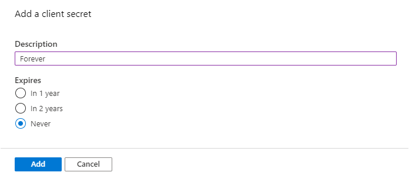
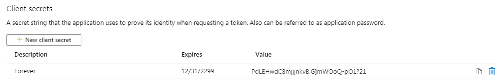

# <a name="how-to-run-the-completed-project"></a><span data-ttu-id="9286e-101">如何运行已完成的项目</span><span class="sxs-lookup"><span data-stu-id="9286e-101">How to run the completed project</span></span>

## <a name="prerequisites"></a><span data-ttu-id="9286e-102">必备条件</span><span class="sxs-lookup"><span data-stu-id="9286e-102">Prerequisites</span></span>

<span data-ttu-id="9286e-103">若要在此文件夹中运行已完成的项目，您需要以下各项：</span><span class="sxs-lookup"><span data-stu-id="9286e-103">To run the completed project in this folder, you need the following:</span></span>

- <span data-ttu-id="9286e-104">在开发计算机上安装的 [.Net CORE SDK](https://dotnet.microsoft.com/download) 。</span><span class="sxs-lookup"><span data-stu-id="9286e-104">The [.NET Core SDK](https://dotnet.microsoft.com/download) installed on your development machine.</span></span> <span data-ttu-id="9286e-105"> ( **注意：** 本教程是使用 .NET Core SDK 版本3.1.201 编写的。</span><span class="sxs-lookup"><span data-stu-id="9286e-105">( **Note:** This tutorial was written with .NET Core SDK version 3.1.201.</span></span> <span data-ttu-id="9286e-106">本指南中的步骤可能适用于其他版本，但尚未经过测试。 ) </span><span class="sxs-lookup"><span data-stu-id="9286e-106">The steps in this guide may work with other versions, but that has not been tested.)</span></span>
- <span data-ttu-id="9286e-107">使用 Outlook.com 上的邮箱的个人 Microsoft 帐户，或者是 Microsoft 工作或学校帐户。</span><span class="sxs-lookup"><span data-stu-id="9286e-107">Either a personal Microsoft account with a mailbox on Outlook.com, or a Microsoft work or school account.</span></span>

<span data-ttu-id="9286e-108">如果你没有 Microsoft 帐户，可以使用以下几种方法获取免费帐户：</span><span class="sxs-lookup"><span data-stu-id="9286e-108">If you don't have a Microsoft account, there are a couple of options to get a free account:</span></span>

- <span data-ttu-id="9286e-109">你可以 [注册新的个人 Microsoft 帐户](https://signup.live.com/signup?wa=wsignin1.0&rpsnv=12&ct=1454618383&rver=6.4.6456.0&wp=MBI_SSL_SHARED&wreply=https://mail.live.com/default.aspx&id=64855&cbcxt=mai&bk=1454618383&uiflavor=web&uaid=b213a65b4fdc484382b6622b3ecaa547&mkt=E-US&lc=1033&lic=1)。</span><span class="sxs-lookup"><span data-stu-id="9286e-109">You can [sign up for a new personal Microsoft account](https://signup.live.com/signup?wa=wsignin1.0&rpsnv=12&ct=1454618383&rver=6.4.6456.0&wp=MBI_SSL_SHARED&wreply=https://mail.live.com/default.aspx&id=64855&cbcxt=mai&bk=1454618383&uiflavor=web&uaid=b213a65b4fdc484382b6622b3ecaa547&mkt=E-US&lc=1033&lic=1).</span></span>
- <span data-ttu-id="9286e-110">你可以 [注册 office 365 开发人员计划](https://developer.microsoft.com/office/dev-program) 以获取免费的 office 365 订阅。</span><span class="sxs-lookup"><span data-stu-id="9286e-110">You can [sign up for the Office 365 Developer Program](https://developer.microsoft.com/office/dev-program) to get a free Office 365 subscription.</span></span>

## <a name="register-a-web-application-with-the-azure-active-directory-admin-center"></a><span data-ttu-id="9286e-111">向 Azure Active Directory 管理中心注册 web 应用程序</span><span class="sxs-lookup"><span data-stu-id="9286e-111">Register a web application with the Azure Active Directory admin center</span></span>

1. <span data-ttu-id="9286e-112">打开浏览器，并转到 [Azure Active Directory 管理中心](https://aad.portal.azure.com)。</span><span class="sxs-lookup"><span data-stu-id="9286e-112">Open a browser and navigate to the [Azure Active Directory admin center](https://aad.portal.azure.com).</span></span> <span data-ttu-id="9286e-113">使用 **个人帐户** （亦称为“Microsoft 帐户”）或 **工作或学校帐户** 登录。</span><span class="sxs-lookup"><span data-stu-id="9286e-113">Login using a **personal account** (aka: Microsoft Account) or **Work or School Account**.</span></span>

1. <span data-ttu-id="9286e-114">选择左侧导航栏中的“ **Azure Active Directory** ”，再选择“ **管理** ”下的“ **应用注册** ”。</span><span class="sxs-lookup"><span data-stu-id="9286e-114">Select **Azure Active Directory** in the left-hand navigation, then select **App registrations** under **Manage**.</span></span>

    

1. <span data-ttu-id="9286e-116">选择“新注册”。</span><span class="sxs-lookup"><span data-stu-id="9286e-116">Select **New registration**.</span></span> <span data-ttu-id="9286e-117">在“注册应用”页上，按如下方式设置值。</span><span class="sxs-lookup"><span data-stu-id="9286e-117">On the **Register an application** page, set the values as follows.</span></span>

    - <span data-ttu-id="9286e-118">将“名称”设置为“`ASP.NET Core Graph Tutorial`”。</span><span class="sxs-lookup"><span data-stu-id="9286e-118">Set **Name** to `ASP.NET Core Graph Tutorial`.</span></span>
    - <span data-ttu-id="9286e-119">将“受支持的帐户类型”设置为“任何组织目录中的帐户和个人 Microsoft 帐户”。</span><span class="sxs-lookup"><span data-stu-id="9286e-119">Set **Supported account types** to **Accounts in any organizational directory and personal Microsoft accounts**.</span></span>
    - <span data-ttu-id="9286e-120">在“重定向 URI”下，将第一个下拉列表设置为“`Web`”，并将值设置为“`https://localhost:5001/`”。</span><span class="sxs-lookup"><span data-stu-id="9286e-120">Under **Redirect URI** , set the first drop-down to `Web` and set the value to `https://localhost:5001/`.</span></span>

    

1. <span data-ttu-id="9286e-122">选择“ **注册** ”。</span><span class="sxs-lookup"><span data-stu-id="9286e-122">Select **Register**.</span></span> <span data-ttu-id="9286e-123">在 **ASP.NET Core Graph 教程** 页面上，将应用程序的值复制 **(客户端) ID** 并保存它，在下一步中将需要它。</span><span class="sxs-lookup"><span data-stu-id="9286e-123">On the **ASP.NET Core Graph Tutorial** page, copy the value of the **Application (client) ID** and save it, you will need it in the next step.</span></span>

    

1. <span data-ttu-id="9286e-125">选择“管理”下的“身份验证”。</span><span class="sxs-lookup"><span data-stu-id="9286e-125">Select **Authentication** under **Manage**.</span></span> <span data-ttu-id="9286e-126">在 " **重定向 uri** " 下，添加值为的 URI `https://localhost:5001/signin-oidc` 。</span><span class="sxs-lookup"><span data-stu-id="9286e-126">Under **Redirect URIs** add a URI with the value `https://localhost:5001/signin-oidc`.</span></span>

1. <span data-ttu-id="9286e-127">将 **注销 URL** 设置为 `https://localhost:5001/signout-oidc` 。</span><span class="sxs-lookup"><span data-stu-id="9286e-127">Set the **Logout URL** to `https://localhost:5001/signout-oidc`.</span></span>

1. <span data-ttu-id="9286e-128">找到“隐式授予”部分，并启用“ID 令牌”。</span><span class="sxs-lookup"><span data-stu-id="9286e-128">Locate the **Implicit grant** section and enable **ID tokens**.</span></span> <span data-ttu-id="9286e-129">选择“ **保存** ”。</span><span class="sxs-lookup"><span data-stu-id="9286e-129">Select **Save**.</span></span>

    

1. <span data-ttu-id="9286e-131">选择“管理”下的“证书和密码”。</span><span class="sxs-lookup"><span data-stu-id="9286e-131">Select **Certificates & secrets** under **Manage**.</span></span> <span data-ttu-id="9286e-132">选择“新客户端密码”按钮。</span><span class="sxs-lookup"><span data-stu-id="9286e-132">Select the **New client secret** button.</span></span> <span data-ttu-id="9286e-133">在 " **说明** " 中输入一个值，然后选择 " **过期** " 选项之一，然后选择 " **添加** "。</span><span class="sxs-lookup"><span data-stu-id="9286e-133">Enter a value in **Description** and select one of the options for **Expires** and select **Add**.</span></span>

    

1. <span data-ttu-id="9286e-135">离开此页前，先复制客户端密码值。</span><span class="sxs-lookup"><span data-stu-id="9286e-135">Copy the client secret value before you leave this page.</span></span> <span data-ttu-id="9286e-136">将在下一步中用到它。</span><span class="sxs-lookup"><span data-stu-id="9286e-136">You will need it in the next step.</span></span>

    > [!IMPORTANT]
    > <span data-ttu-id="9286e-137">此客户端密码不会再次显示，所以请务必现在就复制它。</span><span class="sxs-lookup"><span data-stu-id="9286e-137">This client secret is never shown again, so make sure you copy it now.</span></span>

    

## <a name="configure-the-sample"></a><span data-ttu-id="9286e-139">配置示例</span><span class="sxs-lookup"><span data-stu-id="9286e-139">Configure the sample</span></span>

1. <span data-ttu-id="9286e-140">在 **GraphTutorial** 的目录中打开命令行界面 (CLI) ，并运行以下命令， `YOUR_APP_ID` 从 Azure 门户中的应用程序 ID 和 `YOUR_APP_SECRET` 应用程序机密中进行替换。</span><span class="sxs-lookup"><span data-stu-id="9286e-140">Open your command line interface (CLI) in the directory where **GraphTutorial.csproj** is located, and run the following commands, substituting `YOUR_APP_ID` with your application ID from the Azure portal, and `YOUR_APP_SECRET` with your application secret.</span></span>

    ```Shell
    dotnet user-secrets init
    dotnet user-secrets set "AzureAd:ClientId" "YOUR_APP_ID"
    dotnet user-secrets set "AzureAd:ClientSecret" "YOUR_APP_SECRET"
    ```

## <a name="run-the-sample"></a><span data-ttu-id="9286e-141">运行示例</span><span class="sxs-lookup"><span data-stu-id="9286e-141">Run the sample</span></span>

<span data-ttu-id="9286e-142">在 CLI 中，运行以下命令以启动应用程序。</span><span class="sxs-lookup"><span data-stu-id="9286e-142">In your CLI, run the following command to start the application.</span></span>

```Shell
dotnet run
```
