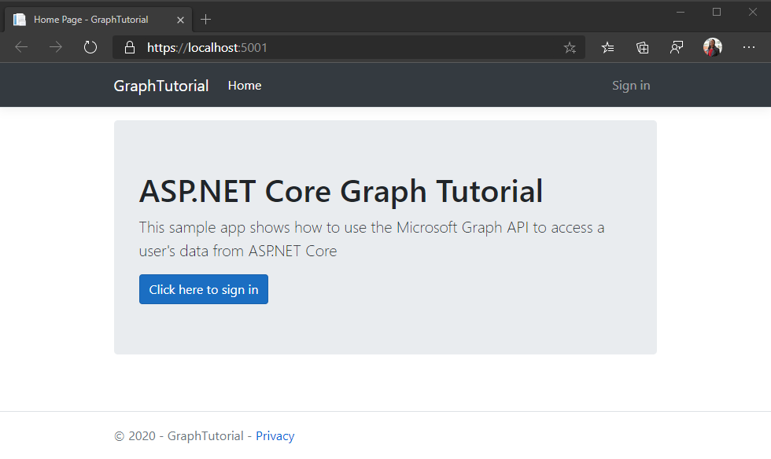

<!-- markdownlint-disable MD002 MD041 -->

首先创建 ASP.NET Core web app。

1. 在要创建项目的目录中打开命令行界面 (CLI) 。 运行以下命令。

    ```Shell
    dotnet new mvc -o GraphTutorial
    ```

1. 创建项目后，通过将当前目录更改为 **GraphTutorial** 目录并在 CLI 中运行以下命令来验证它是否正常工作。

    ```Shell
    dotnet run
    ```

1. 打开浏览器并浏览到 `https://localhost:5001` 。 如果一切正常，您应该会看到一个默认的 ASP.NET Core 页面。

> [!IMPORTANT]
> 如果您收到一条警告，指出 **localhost** 的证书不受信任，可以使用 .NET Core CLI 安装和信任开发证书。 有关特定操作系统的说明，请参阅 [在 ASP.NET Core 中强制 HTTPS](/aspnet/core/security/enforcing-ssl?view=aspnetcore-3.1) 。

## <a name="add-nuget-packages"></a>添加 NuGet 包

在继续之前，请安装稍后将使用的一些其他 NuGet 包。

- 用于请求和管理访问令牌的[Microsoft Web 标识。](https://www.nuget.org/packages/Microsoft.Identity.Web/)
- 通过依赖关系注入添加 Microsoft Graph SDK 的[MicrosoftGraph](https://www.nuget.org/packages/Microsoft.Identity.Web.MicrosoftGraph/) 。
- 用于登录和注销 UI 的[Microsoft. WEB 界面](https://www.nuget.org/packages/Microsoft.Identity.Web.UI/)。
- 用于调用 Microsoft Graph 的[microsoft](https://www.nuget.org/packages/Microsoft.Graph/) graph。
- 用于处理时区标识符跨平台的[TimeZoneConverter](https://github.com/mj1856/TimeZoneConverter) 。

1. 在 CLI 中运行以下命令来安装依赖项。

    ```Shell
    dotnet add package Microsoft.Identity.Web --version 1.1.0
    dotnet add package Microsoft.Identity.MicrosoftGraph --version 1.1.0
    dotnet add package Microsoft.Identity.Web.UI --version 1.1.0
    dotnet add package Microsoft.Graph --version 3.18.0
    dotnet add package TimeZoneConverter
    ```

## <a name="design-the-app"></a>设计应用程序

在本节中，您将创建应用程序的基本 UI 结构。

### <a name="implement-alert-extension-methods"></a>实现警报扩展方法

在本节中，您将为 `IActionResult` 控制器视图返回的类型创建扩展方法。 此扩展将启用将临时错误或成功消息传递给视图。

> [!TIP]
> 可以使用任何文本编辑器编辑本教程的源文件。 但是， [Visual Studio Code](https://code.visualstudio.com/) 提供了其他功能，如调试和智能感知。

1. 在名为 " **警报** " 的 **GraphTutorial** 目录中创建一个新目录。

1. 在 **./Alerts** 目录中创建一个名为 **WithAlertResult.cs** 的新文件，并添加以下代码。

    :::code language="csharp" source="../demo/GraphTutorial/Alerts/WithAlertResult.cs" id="WithAlertResultSnippet":::

1. 在 **./Alerts** 目录中创建一个名为 **AlertExtensions.cs** 的新文件，并添加以下代码。

    :::code language="csharp" source="../demo/GraphTutorial/Alerts/AlertExtensions.cs" id="AlertExtensionsSnippet":::

### <a name="implement-user-data-extension-methods"></a>实现用户数据扩展方法

在本节中，您将为 `ClaimsPrincipal` Microsoft 标识平台生成的对象创建扩展方法。 这将允许您使用 Microsoft Graph 中的数据扩展现有的用户标识。

> [!NOTE]
> 此代码仅为占位符。现在，你将在后续部分中完成此代码。

1. 在名为 **Graph** 的 **GraphTutorial** 目录中创建一个新目录。

1. 创建一个名为 **GraphClaimsPrincipalExtensions.cs** 的新文件，并添加以下代码。

    ```csharp
    using System.Security.Claims;

    namespace GraphTutorial
    {
        public static class GraphClaimTypes {
            public const string DisplayName ="graph_name";
            public const string Email = "graph_email";
            public const string Photo = "graph_photo";
            public const string TimeZone = "graph_timezone";
            public const string DateTimeFormat = "graph_datetimeformat";
        }

        // Helper methods to access Graph user data stored in
        // the claims principal
        public static class GraphClaimsPrincipalExtensions
        {
            public static string GetUserGraphDisplayName(this ClaimsPrincipal claimsPrincipal)
            {
                return "Adele Vance";
            }

            public static string GetUserGraphEmail(this ClaimsPrincipal claimsPrincipal)
            {
                return "adelev@contoso.com";
            }

            public static string GetUserGraphPhoto(this ClaimsPrincipal claimsPrincipal)
            {
                return "/img/no-profile-photo.png";
            }
        }
    }
    ```

### <a name="create-views"></a>创建视图

在本节中，您将实现应用程序的 Razor 视图。

1. 在 **/Views/Shared** 目录中添加一个名为 **_LoginPartial** 的新文件，并添加以下代码。

    :::code language="cshtml" source="../demo/GraphTutorial/Views/Shared/_LoginPartial.cshtml" id="LoginPartialSnippet":::

1. 在 **/Views/Shared** 目录中添加一个名为 **_AlertPartial** 的新文件，并添加以下代码。

    :::code language="cshtml" source="../demo/GraphTutorial/Views/Shared/_AlertPartial.cshtml" id="AlertPartialSnippet":::

1. 打开 **./Views/Shared/_Layout cshtml** 文件，并将其全部内容替换为以下代码，以更新应用程序的全局布局。

    :::code language="cshtml" source="../demo/GraphTutorial/Views/Shared/_Layout.cshtml" id="LayoutSnippet":::

1. 打开 **/wwwroot/css/site.css** ，并将以下代码添加到文件底部。

    :::code language="css" source="../demo/GraphTutorial/wwwroot/css/site.css" id="CssSnippet":::

1. 打开 " **./Views/Home/index.cshtml** " 文件，并将其内容替换为以下内容。

    :::code language="cshtml" source="../demo/GraphTutorial/Views/Home/Index.cshtml" id="HomeIndexSnippet":::

1. 在 **/wwwroot** 目录中创建一个名为 **img** 的新目录。 在此目录中添加你选择命名 **no-profile-photo.png** 的图像文件。 当用户在 Microsoft Graph 中没有照片时，此图像将用作用户的照片。

    > [!TIP]
    > 您可以从 [GitHub](https://github.com/microsoftgraph/msgraph-training-aspnet-core/blob/master/demo/GraphTutorial/wwwroot/img/no-profile-photo.png)下载这些屏幕截图中使用的图像。

1. 保存所有更改，然后重新启动服务器 (`dotnet run`) 。 现在，应用程序看起来应非常不同。

    
