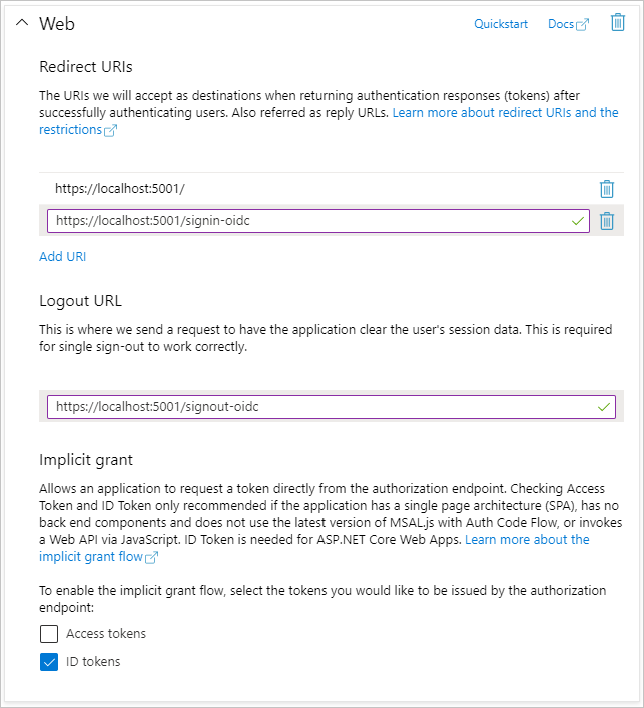
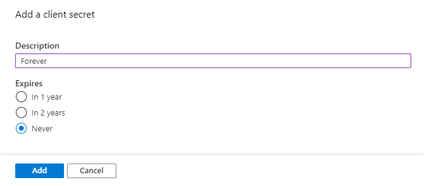

<!-- markdownlint-disable MD002 MD041 -->

在本练习中，你将使用 Azure Active Directory 管理中心创建新的 Azure AD web 应用程序注册。In this exercise, you will create a new Azure AD web application registration using the Azure Active Directory admin center.

1. 打开浏览器，并转到 [Azure Active Directory 管理中心](https://aad.portal.azure.com)。Open a browser and navigate to the [Azure Active Directory admin center](https://aad.portal.azure.com). 使用 **个人帐户** （亦称为“Microsoft 帐户”）或 **工作或学校帐户** 登录。Login using a **personal account** (aka: Microsoft Account) or **Work or School Account**.

1. 选择左侧导航栏中的“ **Azure Active Directory** ”，再选择“ **管理** ”下的“ **应用注册** ”。Select **Azure Active Directory** in the left-hand navigation, then select **App registrations** under **Manage**.

    

1. 选择“新注册”。Select **New registration**. 在“注册应用”页上，按如下方式设置值。On the **Register an application** page, set the values as follows.

    - 将“名称”设置为“`ASP.NET Core Graph Tutorial`”。Set **Name** to `ASP.NET Core Graph Tutorial`.
    - 将“受支持的帐户类型”设置为“任何组织目录中的帐户和个人 Microsoft 帐户”。Set **Supported account types** to **Accounts in any organizational directory and personal Microsoft accounts**.
    - 在“重定向 URI”下，将第一个下拉列表设置为“`Web`”，并将值设置为“`https://localhost:5001/`”。Under **Redirect URI** , set the first drop-down to `Web` and set the value to `https://localhost:5001/`.

    

1. 选择“ **注册** ”。Select **Register**. 在 **ASP.NET Core Graph 教程** 页面上，将应用程序的值复制 **(客户端) ID** 并保存它，在下一步中将需要它。On the **ASP.NET Core Graph Tutorial** page, copy the value of the **Application (client) ID** and save it, you will need it in the next step.

    

1. 选择“管理”下的“身份验证”。Select **Authentication** under **Manage**. 在 " **重定向 uri** " 下，添加值为的 URI `https://localhost:5001/signin-oidc` 。Under **Redirect URIs** add a URI with the value `https://localhost:5001/signin-oidc`.

1. 将 **注销 URL** 设置为 `https://localhost:5001/signout-oidc` 。Set the **Logout URL** to `https://localhost:5001/signout-oidc`.

1. 找到“隐式授予”部分，并启用“ID 令牌”。Locate the **Implicit grant** section and enable **ID tokens**. 选择“ **保存** ”。Select **Save**.

    

1. 选择“管理”下的“证书和密码”。Select **Certificates & secrets** under **Manage**. 选择“新客户端密码”按钮。Select the **New client secret** button. 在 " **说明** " 中输入一个值，然后选择 " **过期** " 选项之一，然后选择 " **添加** "。Enter a value in **Description** and select one of the options for **Expires** and select **Add**.

    

1. 离开此页前，先复制客户端密码值。Copy the client secret value before you leave this page. 将在下一步中用到它。You will need it in the next step.

    > [!IMPORTANT]
    > 此客户端密码不会再次显示，所以请务必现在就复制它。This client secret is never shown again, so make sure you copy it now.

    
