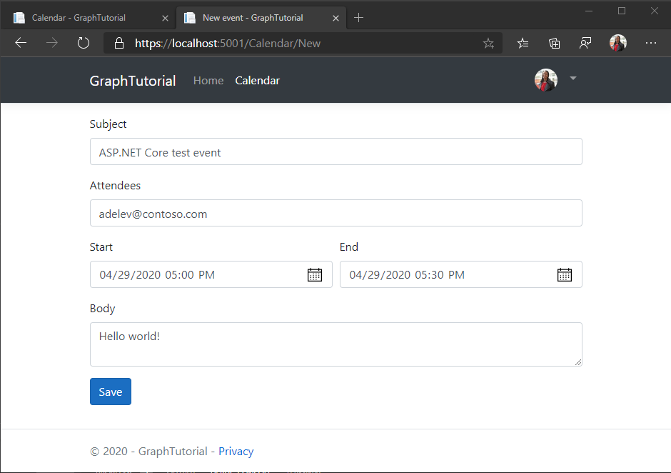

<!-- markdownlint-disable MD002 MD041 -->

在本节中，您将添加在用户日历上创建事件的功能。In this section you will add the ability to create events on the user's calendar.

## 创建模型Create model

1. 在 **./Models** 目录中创建一个名为 **NewEvent.cs** 的新文件，并添加以下代码。Create a new file named **NewEvent.cs** in the **./Models** directory and add the following code.

    :::code language="csharp" source="../demo/GraphTutorial/Models/NewEvent.cs" id="NewEventSnippet":::

## 创建视图Create view

1. 在 **/Views/Calendar** 目录中创建一个名为 " **new.** ." 的新文件，并添加以下代码。Create a new file named **New.cshtml** in he **./Views/Calendar** directory and add the following code.

    :::code language="cshtml" source="../demo/GraphTutorial/Views/Calendar/New.cshtml" id="NewFormSnippet":::

## 添加控制器操作Add controller actions

1. 打开 **/Controllers/CalendarController.cs** ，并将以下操作添加到 `CalendarController` 类以呈现新的事件窗体。Open **./Controllers/CalendarController.cs** and add the following action to the `CalendarController` class to render the new event form.

    :::code language="csharp" source="../demo/GraphTutorial/Controllers/CalendarController.cs" id="CalendarNewGetSnippet":::

1. 将以下操作添加到类中， `CalendarController` 以便在用户单击 " **保存** " 并使用 Microsoft Graph 将事件添加到用户的日历中时从表单接收新事件。Add the following action to the `CalendarController` class to receive the new event from the form when the user clicks **Save** and use Microsoft Graph to add the event to the user's calendar.

    :::code language="csharp" source="../demo/GraphTutorial/Controllers/CalendarController.cs" id="CalendarNewPostSnippet":::

1. 启动应用程序，登录，然后单击 " **日历** " 链接。Start the app, sign in, and click the **Calendar** link. 单击 " **新建事件** " 按钮，填写窗体，然后单击 " **保存** "。Click the **New event** button, fill in the form, and click **Save**.

    
